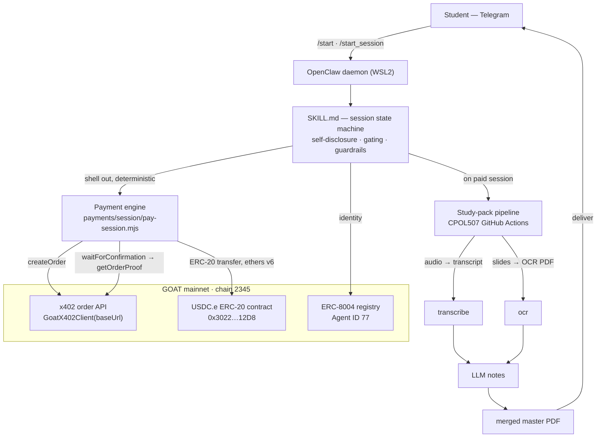

# Aitch — Pay-Per-Session AI Tutoring Agent

> An autonomous tutoring agent that holds its own on-chain identity and wallet, takes
> payment per session in USDC.e, and returns an automated study pack — no subscription,
> no human in the settlement loop below the spend cap.

**Stack:** [OpenClaw](https://clawup.org) self-hosted daemon · **ERC-8004** agent identity (Agent ID **77**) · **x402** payments (`goatx402-sdk-server`) · **GOAT Network mainnet**, chain **2345**, `USDC.e`.

- **Verifiable identity:** [8004scan.io/agents/goat/77](https://8004scan.io/agents/goat/77)
- **Merchant wallet (public):** `0x09eE632927821d7B18Ac76Ff743821A30DA7c6bF`
- **Try it:** [t.me/harshils_hackathon_claw_bot](https://t.me/harshils_hackathon_claw_bot) — send `/start`

---

## The problem

University students in lecture-heavy courses get raw material, not study material. A
professor posts a weekly lecture recording (`.m4a`) next to an image-only slide deck
(`.pptx`) with no text layer. Turning that into something you can actually study from —
transcribe the audio, OCR the slides, cross-reference them, write notes — is roughly
**three hours of mechanical prep per course per week, before any learning starts.**

Existing options miss:

- **Generic AI tutors** answer about the topic in the abstract. They haven't heard *this*
  lecture or seen *this* deck, so they can't tutor on what's actually being tested.
- **Tutoring subscriptions** ($15–40/mo) are the wrong shape for help you need once or
  twice per topic. The cost model punishes irregular use.

## The product

Aitch is a Telegram agent. A student pays **per session** in USDC.e and gets back an
**automated study pack** built from their own course material:

```
lecture audio (.m4a) ─▶ transcript
slide deck (.pptx)   ─▶ OCR'd, searchable PDF
        both          ─▶ LLM-generated structured notes
                      ─▶ merged master PDF  ── the deliverable
```

The study-pack engine is the existing **CPOL507 GitHub Actions pipeline**
(private repo: [`cpol507-pipeline`](https://github.com/Harshil-212369/cpol507-pipeline)).
See [`pipeline/README.md`](pipeline/README.md) for how it plugs in.

Pricing is per session, disclosed for free before any charge. No subscription.

## Architecture



Full detail: [`docs/ARCHITECTURE.md`](docs/ARCHITECTURE.md).

### Order flow (the load-bearing loop)

`createOrder` → **ERC-20 `transfer`** (ethers v6, on-chain) → `waitForConfirmation`
(SDK polls the x402 API) → `getOrderProof`. The SDK issues the order and watches the
chain; **it does not move money** — the on-chain transfer does. Correct SDK surface is
**`GoatX402Client`** with **`baseUrl`** (not `GoatX402` / `apiUrl` / `middleware()`,
which appear in some onboarding docs but are not in the installed package).

## Status

Honest state of the build. Labels: **DONE** (working, verified) · **OPEN** (in progress /
not wired) · **DRAFT** (designed, not built).

| Area | State | Notes |
|---|---|---|
| ERC-8004 identity (Agent ID 77) | **DONE** | Registered on GOAT mainnet, verifiable at 8004scan.io/agents/goat/77 |
| x402 live settlement | **DONE** | Real 1 USDC.e transfer settled on-chain (see below) |
| Payment engine `pay-session.mjs` | **DONE** | Two-tier guardrail, dry-run default, on-chain guards, timeout branch |
| Two-wallet model (payer ≠ merchant) | **DONE** | Funding + diagnostics scripts included |
| Read-only diagnostics (balance/gas/order/merchant) | **DONE** | No keys required for the read-only checks |
| Study-pack pipeline (CPOL507) | **DONE** | Runs as GitHub Actions in the private `cpol507-pipeline` repo |
| Telegram `SKILL.md` session state machine | **OPEN** | Spine designed; disclosure + order handler wiring in progress |
| `HEARTBEAT.md` (health + spend-cap reset) | **DRAFT** | Thin by design; off the payment path |
| Indexer reconciliation latency handling | **OPEN** | Timeout branch works; polishing status-ping UX |
| ERC-8004 Agent Card buyer-language rewrite (discovery) | **OPEN** | For agent-to-agent routing |
| Seed-user pilot (Stage 2) | **OPEN** | Target 10–20 users; see docs/SEED_USERS.md |

### x402 payment flow is live

A real settlement has executed on GOAT mainnet:

| Field | Value |
|---|---|
| Payer (B, student) | `0xBB086b3b05Cf958c16414A0Bdd9b43A53aDb7087` |
| Merchant (A, Aitch) | `0x09eE632927821d7B18Ac76Ff743821A30DA7c6bF` |
| Amount | 1 USDC.e |
| Flow | `ERC20_DIRECT` |
| Block | 13802564 |
| Tx | `0xe89e16dffd7713954b27b0b2e788af6700cea0c9e0346c787e8ec89672b6c7c5` |

**Known latency characteristic (not a failure).** On this settlement, the x402 order's
indexer reconciliation lagged past the client poll window. The **on-chain transfer is
irreversible and confirmed** — the value moved. This is an indexer/reconciliation lag,
handled explicitly by the engine's timeout branch: it never sends a second transfer, it
surfaces the current order status, and it directs reconciliation to the portal. See the
`catch` branch in [`payments/session/pay-session.mjs`](payments/session/pay-session.mjs)
and [`docs/ENGINEERING_DECISIONS.md`](docs/ENGINEERING_DECISIONS.md).

## Quickstart

### Run the payment engine locally

```bash
# 1. Install deps (root node_modules resolves for the payments/ scripts)
npm install

# 2. Configure — copy the template and fill in locally (never commit .env)
cp .env.example .env
#   edit .env: GOATX402_* creds, AGENT_ADDRESS/STUDENT_ADDRESS,
#   and the two *_PRIVATE_KEY values (kept out of git by .gitignore)

# 3. Read-only preflight — no keys, no funds move
node payments/diagnostics/balance-check.mjs      # gas + USDC.e balance
node payments/diagnostics/gas-check.mjs          # can we afford the txs?
node payments/diagnostics/merchant-check.mjs     # merchant listed & USDC.e-ready?

# 4. Dry run the session payment (creates an order, sends NOTHING)
node payments/session/pay-session.mjs

# 5. Execute for real (moves 1 USDC.e). Requires --confirm AND, above the
#    spend cap, an interactive "CONFIRM PAYMENT" typed at the prompt.
node payments/session/pay-session.mjs --confirm
```

Every money-moving script is **dry-run by default** and refuses to run if the derived
signer doesn't match the expected address or if payer == merchant.

### Run the website

```bash
cd site
npx serve .        # or: python -m http.server
# open http://localhost:3000  →  "/"  landing · "/project"  project hub
```

Static, zero build step. Deploy to Vercel by pointing it at [`site/`](site/) — see
[`site/README.md`](site/README.md).

## Repository layout

```
README.md                     ← you are here
.env.example                  ← config template, placeholders only
.gitignore                    ← secrets / media / notes excluded
.github/workflows/ci.yml      ← secret scan + syntax check (contents: read only)
docs/
  ARCHITECTURE.md             ← daemon, SKILL.md, x402 order flow, ERC-8004 identity
  ENGINEERING_DECISIONS.md    ← decision log (SDK truth, guardrails, latency, two-wallet)
  SEED_USERS.md               ← Stage-1 deliverable: seed user definition
  GROWTH_METRICS.md           ← Stage-1 deliverable: growth metrics proposal
  SECURITY.md                 ← secret scanning + push protection setup
skills/
  study-pack/SKILL.md         ← tutoring / study-pack skill spec
  payment-session/SKILL.md    ← x402 session-payment skill spec
payments/
  session/pay-session.mjs     ← canonical payment engine (tested)
  funding/fund-student.mjs    ← funds the payer wallet (gas + USDC.e)
  diagnostics/                ← read-only: balance / gas / order / merchant checks
pipeline/README.md            ← how the CPOL507 study-pack engine plugs in
site/                         ← static landing (/) + project hub (/project)
scripts/scan-secrets.sh       ← pre-push private-key scanner
```

## Security

No private key, seed phrase, API key, or secret lives in this repo — in code, in the
tree, or in history. All money-moving scripts read secrets from `process.env` only.

- **`.env` is gitignored**; only `.env.example` (placeholders) is committed.
- **Pre-push scan:** `bash scripts/scan-secrets.sh` flags any `0x`-prefixed 64-hex
  string (private-key shape). The public settlement tx hash is explicitly allowlisted.
- **CI** runs the same scan with `permissions: { contents: read }` and never uses
  `pull_request_target`.

**Enable GitHub secret scanning + push protection** (do this on the remote):

1. Repo **Settings → Code security and analysis**.
2. Enable **Secret scanning**, then **Push protection**.
3. With push protection on, GitHub blocks a push that contains a detected secret before
   it lands. If you ever commit a key by mistake: **rotate it immediately** — a key that
   touched git history is compromised even after removal.

Details and the org-wide setup: [`docs/SECURITY.md`](docs/SECURITY.md).

## License

MIT — see [LICENSE](LICENSE).
