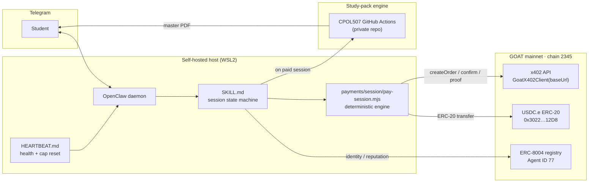
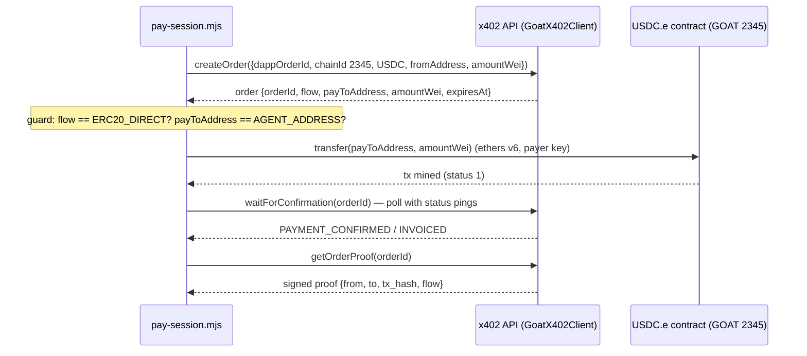

# Architecture — Aitch

Aitch is an autonomous pay-per-session tutoring agent. This document describes the four
moving parts and how a session flows through them: the **OpenClaw daemon**, the
**`SKILL.md`** session brain, the **x402 order flow**, and the **ERC-8004 identity**.

## System overview



## 1. OpenClaw daemon

OpenClaw is the agent runtime. It runs self-hosted on WSL2, connects to Telegram via a
BotFather HTTP API token, and loads markdown **skills** that define the agent's behaviour.
The daemon is the process boundary between the LLM (which orchestrates conversation) and
the deterministic Node scripts (which move money).

Design rule: **the LLM never holds a private key and never moves funds directly.** It
shells out to the payment engine, which reads secrets from `process.env` (loaded from the
host secrets vault at daemon startup). This keeps settlement auditable and out of LLM
improvisation.

Key hardening facts:

- Secrets live in a vault file (`chmod 600`, dir `chmod 700`) loaded into the daemon
  environment at startup. The vault does not persist across WSL restarts by design.
- The `goat-agent` skill template **defaults to Testnet3 (chain 48816)** — Aitch always
  **overrides to mainnet 2345 / `rpc.goat.network`**. Getting this wrong is a silent
  "works but on the wrong chain" failure, so it is asserted in every script.

## 2. SKILL.md — the session state machine

`SKILL.md` is what OpenClaw loads to *behave* as Aitch: self-disclosure copy, the command
set, the payment procedure (with exact shell calls), a result-interpretation table, the
guardrail rules, and the tutoring-delivery spec. It orchestrates; it does not settle.

The canonical agent loop (from the bootcamp reference workflow) is
**verify identity → take x402 payment → complete task → return result**. Concretely:

```
/start          → self-disclosure (FREE): what Aitch does, commands, pricing
/start_session  → createOrder(x402) → return payment details
                → [GUARDRAIL] amount > low-tier cap? require explicit "CONFIRM PAYMENT"
                → student wallet: ERC-20 transfer (ethers v6)
                → poll waitForConfirmation   ← SLOW: emit ack + status pings, never freeze
                → confirmed: getOrderProof → unlock session
                → timeout/error: explain + offer retry/abort (never crash, never silent)
[session]       → tutor on the submitted material; stateless per request; decrement cap
/end_session    → log, summary, close
```

Two behaviours are first-class, not afterthoughts:

- **Latency status-pings.** On-chain settlement is slow (the #1 UX risk observed in the
  bootcamp mainnet demo). The loop sends an immediate ack ("Order created, settling
  on-chain…") and status pings while polling, so it never looks frozen.
- **Two-tier confirmation.** Below the low-tier spend cap (0.1 USDC.e) Aitch acts
  autonomously. Above it — or for config/receiving-wallet changes — it halts and requires
  an explicit typed `CONFIRM PAYMENT`.

See [`skills/study-pack/SKILL.md`](../skills/study-pack/SKILL.md) and
[`skills/payment-session/SKILL.md`](../skills/payment-session/SKILL.md).

### HEARTBEAT.md

Deliberately thin: health checks and spend-cap reset only. The session is user-driven via
`/start_session`, so the heartbeat is **not** on the payment path — it can't initiate a
charge.

## 3. x402 order flow

Payments use the `goatx402-sdk-server` package. The SDK is an **order-based HTTP API
client**, not the `x402.middleware()` Express pattern that appears in some onboarding
docs (that pattern is not in the installed package — building against it would be dead
code). The **SDK issues orders and watches the chain; it does not move money.**



**Correct SDK surface:** `new GoatX402Client({ baseUrl, apiKey, apiSecret })`. Not
`GoatX402`, not `apiUrl`, not `merchantId`-in-config. Base URL is the mainnet host
`https://x402-api.goat.network`.

**Flow branches.** `createOrder` returns a `flow`. Only `ERC20_DIRECT` is auto-executed.
`ERC20_3009` (gasless EIP-712) and `ERC20_APPROVE_XFER` **halt** rather than guess the
signature or approve calldata — failing safe beats a wrong on-chain action. Aitch's
merchant is `DIRECT`.

**Decimals fail-safe.** USDC.e is assumed 6 decimals at quote time; the engine reads
`decimals()` on-chain and aborts on mismatch rather than send a wrong amount.

**Latency / reconciliation.** After the transfer mines, the indexer may lag past the poll
window. The transfer is already irreversible; the engine surfaces the order's current
status, **never sends a second transfer**, and points reconciliation to the portal. This
is the behaviour exercised by the live Stage-1 settlement documented in the README.

## 4. ERC-8004 identity

Aitch holds a portable on-chain identity under **ERC-8004** — **Agent ID 77** on GOAT
mainnet, verifiable at [8004scan.io/agents/goat/77](https://8004scan.io/agents/goat/77).
The identity carries the agent's wallet and accrues reputation, making the agent
discoverable across ecosystems without re-registering.

Discoverability is a graded deliverable ("AI optimization for LLM discovery"). Aitch's
surface for it is the **ERC-8004 Agent Card `description`**, written in buyer-language
("pay-per-session tutoring, per-topic, no subscription") so agent-to-agent routing
surfaces it for the queries a buyer would actually make.

## Two-wallet model

Payer and receiver are **two distinct wallets** by design:

- **A — merchant / Aitch** (`AGENT_ADDRESS`): receives USDC.e.
- **B — student / payer** (`STUDENT_ADDRESS`): sends USDC.e.

Rationale: a self-transfer (payer == merchant == agent) risks the indexer not confirming
cleanly. Distinct wallets give a clean confirmation and mirror the real product topology
(students pay the agent). Scripts assert `payer != merchant` and that each private key
derives its expected address before doing anything.

- [`payments/funding/fund-student.mjs`](../payments/funding/fund-student.mjs) — merchant A
  bootstraps payer B with gas + USDC.e.
- [`payments/session/pay-session.mjs`](../payments/session/pay-session.mjs) — payer B pays
  merchant A per session.
